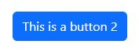

## Description

A simple button



```twig
{{ component('proglab_button', {
    style: 'primary',
    type: 'button',
    label: 'This is a button 2',
    size: null,
    disabled: false,
    class: null
}) }}
```
## Parameters

**R = Required**

| Parameter     | Type      | Description            | Accepted Values                                                                 | Default Values |
|:--------------|:----------|:-----------------------|---------------------------------------------------------------------------------|----------------|
| `label` **R** | `string`  | The label              |                                                                                 | null           |
| `style`       | `string`  | The bootstrap style    | primary, secondary, success,<br/> danger, warning, info,<br/> light, dark, link | primary        |
| `type`        | `string`  | The button HTML type   | button, submit, reset                                                           | button         |
| `size`        | `?string` | The size of the button | sm, gd, null                                                                    | null           |
| `disabled`    | `bool`    |                        | true, false                                                                     | false          |
| `class`       | `?string` |                        |                                                                                 | null           |


## Usage/Examples

```twig
  {{ component('proglab_button', {
          label: 'Ceci est un bouton 3'
      }) 
  }}
```