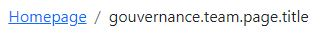

## Description

A simple breadcrumb



```twig
{{ component('proglab_breadcrumb', {
    pages : [
        {
            'title' : 'Title of the link',
            'link' : '/page'
        }
    ],
    homepageUrl: 'http://localhost',
    homepageLabel: 'Homepage',
}
) }}
```
## Parameters

| Parameter       | Type      | Description       | Default Values |
|:----------------|:----------|:------------------|----------------|
| `title`         | `string`  | **Required**      |                |
| `url`           | `?string` | The link          |                |
| `homepageUrl`   | `?string` | Route name        |                |
| `homepageLabel` | `?string` | Label of the link | Homepage       |


## Usage/Examples

```twig
{{ component('proglab_breadcrumb', {
    pages : [
        {
            'title' : 'Title of the link'
        }
    ]
}) }}
```